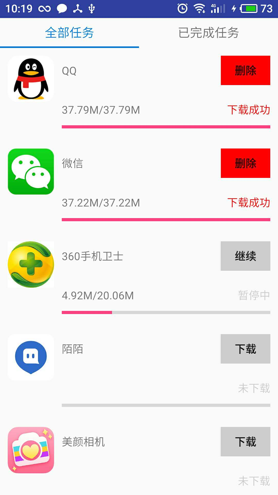
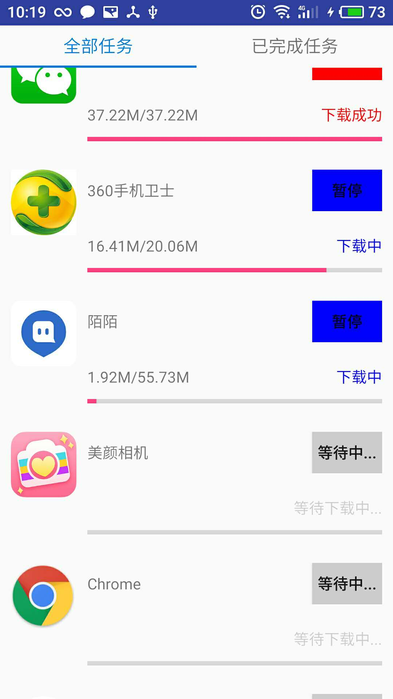

# MultiDownloader

&nbsp; &nbsp; &nbsp; &nbsp; &nbsp; &nbsp; &nbsp; &nbsp; &nbsp; &nbsp; 

### 为什么要做这个项目

最近一直在听喜马拉雅(绝对不是广告)，经常离线下载音频节目，觉得这一块以前并没有认真的做过，算是一块短板，遂起了这个念头。

思路：

很简单的一个小项目，分为`全部任务`和`下载完成`两个模块，一单任务下载完成，通知栏进行通知。

### 简单分析

**功能简述**

1. 可设置同时最大下载线程数量
2. 下载完某一任务后，自动取出等待池中的任务继续下载
3. 可随时暂停下载，自动保存下载记录

**下载的实现**

下载类DownloadManager为DownloadService的静态类，所以他的生命周期和DownloadService相同，当DownloadService被销毁时，我们手动地清理DownloadManager。

DownloadService提供下载接口，DownloadManager具体实现。

为了记录每一个文件的下载状态，所以必须要用Sqlite保存下载的状态，如文件的总大小、已下载大小等等信息。在下载过程中，有两个异常需要考虑：

1. 网络中断
2. 进程被杀死

> 问题1：如果下载过程中，网络中断了怎么办？

	答：网络中断异常可以被捕获到，一旦出现该异常，则立刻将下载状态变为暂停，保存下载数据到sql中。

> 问题2：如果下载过程中，进程被强行杀死怎么办？

	答：下载任务放在Service中执行，如果用户通过返回键回到桌面，那么Activity被销毁，但是Service仍然在运行，执行下载任务。如果用户在任务列表中强行杀死进程，那么Service也会立刻被回收，且onDestroy()方法不会执行，所以在下载过程中我们就要边下载，边保存数据要sql。也就是说，下载了多少字节，我们便如实的记录到sql，等再次进入app时，我们读出下载记录，然后再更新界面。

**RecyclerView中的复用问题**

界面显示问题：

1. Adapter中每一个Item的显示

	每一个Item的界面怎么显示，是由对应的数据决定的，这里可以认为是DownloadInfo这个对象，他的数据状态决定了Item的显示状态(未下载、下载中、暂停中、已完成)

2. DownloadInfo从哪来？
	
	因为下载数据必须必记录下来，最好的办法是从本地数据库中取出，如果没有，则创建一个空白的下载记录，并保存到数据库；如果有，则直接更新。
	
3. DownloadInfo怎么更新？	

	给每一个DownloadInfo设置一个监听器，这个监听器会根据DownloadInfo的数据更新Item界面。

下载逻辑：
	
1. 当用户点击下载时，究竟发生了什么？

	当Adapter被创建的时候，启动DownloadService，并获得引用。当用户点击下载的时候，尝试着从数据库中拿到对应的DownloadInfo，把该引用交给DownloadService，执行下载(或者暂停)等流程。
	
2. 	DownloadService做了什么事？

	DownloadService仅提供下载的API,具体的下载由其内部的静态内部类DownloadManager统一管理。
	
3. 暂停如何实现？

	DownloadInfo是唯一的，数据同步的，下载任务根据DownloadInfo的状态决定执行何种操作(开始下载、暂停下载、继续下载)。

**数据库的使用**

[GreenDao](https://github.com/greenrobot/greenDAO) 这个看文档就可以了

 

